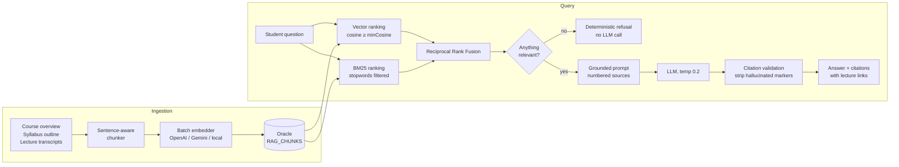

# Grounded Course Tutor (RAG)

The AI tutor answers student questions **from the actual content of the course
they are asking about**, with citations that link back to the exact lecture.
This document covers the architecture, the design decisions and their
trade-offs, how to run it, and how it is evaluated.

## Why

A generic LLM chatbot bolted onto an LMS confidently answers from its training
data — which may contradict what the instructor actually teaches, and
hallucinates when asked about course specifics. Retrieval-Augmented Generation
(RAG) fixes both failure modes: the model is only allowed to answer from
retrieved course content, cites what it used, and refuses when the content
doesn't cover the question.

## Architecture



### Module map

| File | Responsibility |
|------|----------------|
| `lib/ai/rag/chunker.js` | Sentence-aware sliding-window chunking with overlap |
| `lib/ai/rag/similarity.js` | Pure ranking primitives: cosine, BM25, RRF |
| `lib/ai/rag/store.js` | Oracle persistence (`RAG_CHUNKS`, `LECTURE_TRANSCRIPTS`) |
| `lib/ai/rag/retriever.js` | Hybrid retrieval + per-course index cache |
| `lib/ai/rag/ingest.js` | Corpus building, hash-diffed re-embedding |
| `lib/ai/rag/answer.js` | Grounded prompting, citation validation |
| `pages/api/ai/rag.js` | API: `ask` / `status` / `ingest` / `transcript` |
| `docker/oracle/init/06_rag_schema.sql` | Schema + demo transcripts |
| `scripts/rag-eval.js` + `eval/rag-goldens.json` | Evaluation harness |

## Design decisions

**In-process retrieval instead of a vector database.** A course corpus is at
most a few hundred chunks, and every query is scoped to one course. Exact
cosine scoring over a few hundred vectors takes microseconds — an external
vector DB would add infrastructure and network hops to make an O(hundreds)
problem faster. Embeddings are stored as float32 BLOBs in Oracle next to the
data they index, and a per-course index is cached in-process with a TTL.
*Scaling path*: if corpora grow to tens of thousands of chunks, swap
`retriever.js` internals for Oracle 23ai's native `VECTOR` type or pgvector —
the store/retriever interfaces already isolate that decision.

**Hybrid retrieval (vector + BM25), fused with RRF.** Embeddings catch
paraphrases ("how do I make the model learn?" → gradient descent); BM25
catches exact terms that embedding models underweight (`useEffect`, error
codes, acronyms). Reciprocal Rank Fusion combines the two rankings without
having to calibrate their incomparable score scales.

**Absolute relevance gates for out-of-scope detection.** RRF is rank-based:
even a nonsense question produces a "top-ranked" chunk. Two gates prevent
that: a chunk enters fusion only if BM25 finds real (stopword-filtered) term
overlap, or its cosine similarity clears `RAG_MIN_COSINE`. If nothing
survives, the tutor refuses **without calling the LLM** — deterministic,
honest, and free.

**Citation validation, not citation trust.** The model is instructed to cite
sources as `[n]`, but instructions are not guarantees. After generation, the
server strips any marker pointing at a source that wasn't provided and returns
only actually-cited sources to the client, each with a snippet and the lecture
video link.

**Idempotent, cost-aware ingestion.** Every chunk carries a SHA-256 content
hash. Re-indexing loads existing hashes and re-embeds only changed chunks —
editing one lecture transcript re-embeds only that lecture's chunks. The
corpus swap is transactional (delete + insert in one transaction).

**Offline-first development.** With `AI_PROVIDER=local`, embeddings come from
a deterministic hashing embedder (signed feature hashing over stopword-
filtered tokens, sublinear TF, L2-normalized) and chat responses from a mock
that synthesizes a cited answer from the retrieved sources. The entire
pipeline — ingest, retrieve, answer, eval — runs with no API keys.

## Data model

```sql
EDUX.LECTURE_TRANSCRIPTS (L_ID PK → Lectures, CONTENT CLOB, LANGUAGE, SOURCE, UPDATED_AT)

EDUX.RAG_CHUNKS (
  CHUNK_ID identity PK,
  C_ID → Courses (cascade), T_ID → Topics, L_ID → Lectures,
  SOURCE_TYPE  'overview' | 'syllabus' | 'lecture',
  TITLE, CONTENT CLOB,
  CONTENT_HASH SHA-256 hex,        -- idempotent re-ingestion
  SEQ,
  EMBEDDING BLOB (float32 LE),     -- 4 bytes x dimensions
  EMBEDDING_MODEL,                 -- e.g. 'openai:text-embedding-3-small'
  CREATED_AT, UPDATED_AT
)
```

`EMBEDDING_MODEL` is checked at retrieval time: vectors produced by a
different model than the active one are never compared (the retriever falls
back to BM25-only and logs a warning to re-ingest).

## Using it

1. **Schema**: fresh Docker databases pick up
   `docker/oracle/init/06_rag_schema.sql` automatically (it also seeds demo
   transcripts for the sample React/Node/Python courses). For an existing
   database, run that file once manually.
2. **Index a course**: as the course's instructor, open
   *Instructor → Manage Course* and click **Build index** (or `POST
   /api/ai/rag {action:'ingest', courseId}`). Attach transcripts via
   `{action:'transcript', lectureId, content}` — the course re-indexes
   automatically and cheaply.
3. **Ask**: the student-facing AI chat automatically uses grounded answers
   whenever it is opened with a `courseId` and the course is indexed; courses
   without an index fall back to the generic assistant. Citations render as
   numbered source links under the answer.

### API

`POST /api/ai/rag` (authenticated):

| action | who | body | returns |
|--------|-----|------|---------|
| `ask` | any user | `courseId`, `question`, `conversationHistory?`, `debug?` | `status` (`ok`/`no_match`/`not_indexed`), `answer`, `citations[]`, `retrieval` stats, `sources[]` when `debug` |
| `status` | any user | `courseId` | `chunkCount`, `embeddedCount`, `embeddingModel`, `updatedAt` |
| `ingest` | owning instructor | `courseId` | chunk/embed/reuse counts |
| `transcript` | owning instructor | `lectureId`, `content` | save + re-index stats |

## Evaluation

`eval/rag-goldens.json` holds a golden Q&A set for the seeded demo courses:
on-topic questions annotated with the lecture that contains the answer,
syllabus-level questions, and out-of-scope questions that must be refused.

```bash
# server running against the seeded Docker DB
npm run rag:eval          # ingests demo courses, runs all cases, prints metrics
node scripts/rag-eval.js --min-hit 0.8 --json eval/report.json   # CI quality gate
```

Metrics reported:

| Metric | Meaning |
|--------|---------|
| retrieval hit@k | expected lecture appears in the retrieved sources |
| retrieval MRR | mean reciprocal rank of the first expected source |
| citation precision | fraction of cited sources that are the expected ones |
| keyword coverage | expected answer keywords present in the answer (soft faithfulness signal) |
| out-of-scope accuracy | out-of-scope questions correctly refused |
| mean latency | end-to-end per-question latency |

The harness works with any provider, including `local`, so it doubles as an
offline smoke test. Use it to tune `RAG_MIN_COSINE` / `RAG_MIN_SCORE` when
changing embedding models.

## Tuning knobs (env)

| Variable | Default | Effect |
|----------|---------|--------|
| `RAG_CHUNK_SIZE` / `RAG_CHUNK_OVERLAP` | 1100 / 180 chars | chunk granularity vs. context continuity |
| `RAG_TOP_K` | 5 | sources stuffed into the prompt |
| `RAG_MIN_COSINE` | 0.2 | vector out-of-scope gate (model-dependent) |
| `RAG_MIN_SCORE` | 0.015 | fused-score floor after RRF |
| `RAG_INDEX_CACHE_TTL_MS` | 300000 | per-course index cache lifetime |
| `OPENAI_EMBEDDING_MODEL` | `text-embedding-3-small` | OpenAI embedding model |
| `GEMINI_EMBEDDING_MODEL` | `text-embedding-004` | Gemini embedding model |

## Known limitations

- **Transcript acquisition is manual.** Lectures are YouTube links; the system
  grounds on transcripts an instructor attaches (or the seeded demo ones).
  Automatic caption import is a natural extension point (`SOURCE='auto'` is
  already modeled).
- **No timestamp-level citations.** Citations link to the lecture video, not a
  second offset — transcripts aren't stored with timing data.
- **In-process index cache** assumes a single app instance; after re-ingest
  from another instance, stale reads last at most the cache TTL (5 min).
- **English-oriented lexical layer.** The stopword list and tokenizer are
  English; other languages still work via embeddings but lose BM25 quality.
